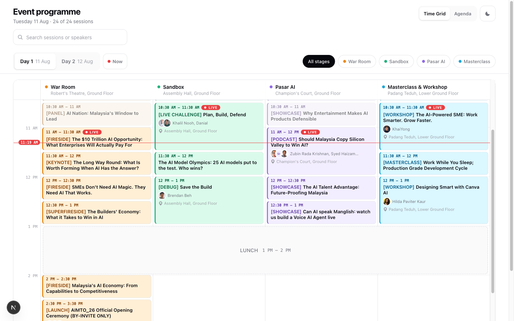
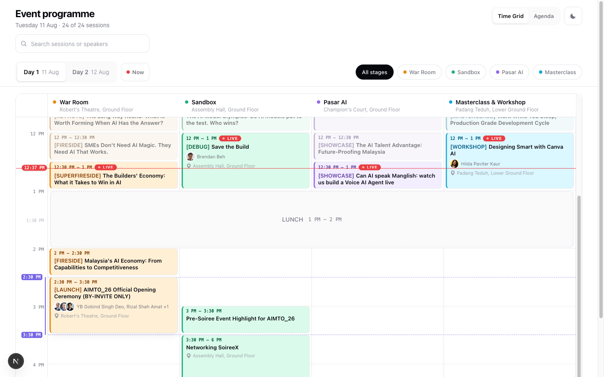
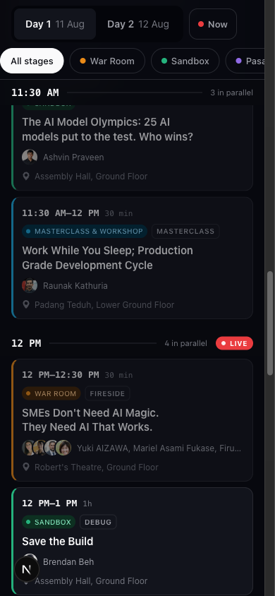
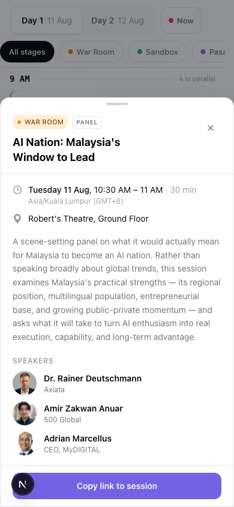
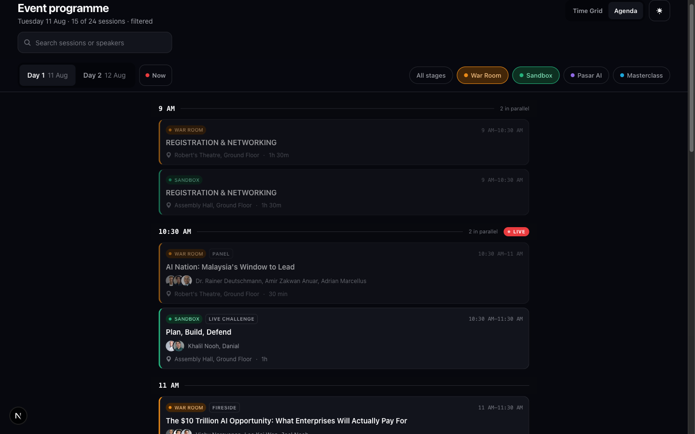

# Agenda views

Two views over one multi-track conference programme:

| Viewport | View | Why |
| --- | --- | --- |
| ≥1024px | **Time grid** — columns = stages, rows = time, blocks sized by duration | Concurrency is the question a desktop reader is asking: "what else is on at 11:30?" A grid answers it geometrically. |
| <1024px | **Agenda** — one chronological column, sticky time rails, parallel sessions grouped | Four lanes in 390px means either horizontal scroll (hides tracks) or 60px columns (truncates every title). Neither is usable. |

Rebuilt from the [AIMTO 2026 programme](https://aimto.my/program.php) — real data, 49 sessions, 2 days, 4 stages, overlapping and non-aligned session times.



Hovering or focusing a block writes its exact start and end into the time gutter and rules them across every lane, so "when is this, and what runs against it" is answered without opening anything:



| Mobile agenda | Session detail | Dark + filtered |
| --- | --- | --- |
|  |  |  |

## Run

```bash
pnpm install
pnpm dev            # http://localhost:3000
pnpm build
```

## What the original does badly on mobile

The source page renders the same desktop structure at every width:

1. **The time gutter never collapses.** ~100px of a 390px screen is permanently spent on a column of timestamps that repeat down the page.
2. **Nothing sticks.** Scroll three sessions in and you no longer know what time you are looking at, which day you picked, or which stage filter is active.
3. **Filters cost three rows.** Five stage pills wrap to three lines instead of scrolling horizontally on one.
4. **Every card is fully expanded.** Full abstracts inline means ~5 screens of scroll per hour of programme, so scanning is impossible.
5. **No detail layer.** Because everything is inline, there is nowhere to put speaker bios, and no way to link to a single session.
6. **A session's own time is not on the session.** The only timestamp is in the left rail, it shows the *block's* range rather than each card's, and there are no rules to measure against — so two cards sitting side by side under one rail can run 30 minutes and 3 hours and look identical. This is the failure that actually makes people show up at the wrong time.
7. **No sense of "now".** During the event the most important question is "what is on right now" and the page cannot answer it.

## The patterns this implements

Drawn from how Sched, Whova, Swapcard, Google I/O, WWDC, and the native Apple/Google Calendar day views handle the same problem.

### Desktop time grid

- **Absolute positioning, not CSS grid rows.** Sessions here start at 10:30 and end at 11:00 *or* 11:30 — they do not share a row unit. A row-based grid forces everything onto the coarsest common boundary and destroys the actual shape of the day. Blocks are placed at `offsetMinutes × pxPerMinute`.
- **2.3px per minute.** The smallest scale at which the shortest real session (30 min → 69px) still fits a time row plus a two-line title. Below that, half the programme becomes unidentifiable without clicking.
- **Progressive density by block height** (`density()` in `track-grid.tsx`) — under 30 min: one title line; 30–45: two lines; 45–60: + speakers; 60+: + location. Content is a function of available height, not a fixed template that overflows.
- **Overlap packing within a lane.** Sessions that overlap inside one stage are split into side-by-side sub-columns via interval-graph colouring; non-overlapping neighbours reuse the full width. (Day 2 needs this: a 4-hour Learn-a-Thon runs under shorter Sandbox sessions.)
- **Two rule weights: solid on the hour, dotted on the half.** Most sessions in a conference programme start on `:30`, and with hour-only rules the eye has nothing to measure those top edges against. Half-hour labels render in the gutter too, one step down in size and contrast.
- **Hover/focus projects a block's span back onto the gutter** — a brand-coloured bar spanning exactly its start→end, its two timestamps written as chips at the edges (replacing the generic ticks there), and dashed guide lines drawn across every lane at both edges. This is what answers "when is this *actually*, and what else runs against it" without opening anything.
- **Sticky time gutter + sticky stage header**, both pinned inside the grid's own scroll container.
- **A now-line with the current time in the gutter**, auto-scrolled into view once on the running day. Hour ticks within 18 minutes of it are suppressed rather than overlapped.
- **Plenary rows span all lanes.** Lunch is not a track — it renders as a full-width band.

### Mobile agenda

- **Time becomes a sticky rail, not an axis.** Each start-time group gets a pinned header that stays until the next block. Concurrency reads as *"10:30 — 4 in parallel"* instead of as column position.
- **The sticky region is only the controls.** The title and search scroll away; day tabs + stage chips stay. A full sticky header would consume ~40% of a 390px viewport.
- **Stage filters scroll horizontally on one line** with snap points, not three wrapped rows.
- **Time leads every card, in the highest-contrast type on it** — full `start–end` range plus duration, above the title. On the source site the only timestamp was in a rail that scrolled away, so two cards in the same block reading `12 PM–12:30 PM · 30 min` and `12 PM–1 PM · 1h` were indistinguishable. This is the single change that stops the misread.
- **Cards are scan-sized**: time, stage, format, title, speaker faces, room. The abstract lives in the detail sheet.
- **Bottom sheet for detail**, centred dialog on desktop — same component, one breakpoint.
- **Whole card is the tap target**, always ≥44px.

### Shared

- Deep-linkable state: `?day=&stage=a,b&q=&view=&session=`. A `?session=` link opens the sheet on the right day. Written with `replaceState`, so Back leaves the page instead of stepping through every filter change.
- One shared clock ticking on minute boundaries via `useSyncExternalStore` — N components, one timer. Live/past/upcoming status and the now-line derive from it.
- Event time is treated as fixed wall-clock at GMT+8, converted from the visitor's real clock. A visitor in London sees the correct sessions marked live.

### Accessibility

- Day switcher is a real WAI-ARIA tablist: roving `tabindex`, arrow keys, Home/End; Tab exits the group.
- Stage filters are toggle buttons with `aria-pressed` — they are multi-select, so tabs/radios would be the wrong role.
- The time grid conveys time through geometry, which a screen reader cannot follow, so it is mirrored by a visually-hidden ordered list in reading order.
- The sheet is a genuine modal: focus trapped, Escape closes, background scroll locked, focus restored to the trigger.
- Search results announced via `aria-live="polite"`.
- Visible focus rings everywhere; `prefers-reduced-motion` collapses all animation; pinch-zoom left enabled (`maximumScale: 5`).
- Stage colours never carry meaning alone — every block also states its stage in text.

## Extraction readiness

The components hold no global state, so this is a copy-paste away from being a package rather than a rewrite.

- **Data comes in as a prop.** `<AgendaShell agenda={…}>` wraps `<AgendaProvider>`; every component reads its agenda from `useAgenda()`. `lib/agenda.ts` imports nothing and takes an `AgendaIndex` argument — it is already the headless half.
- **No framework lock-in in the views.** No `next/image` (plain ``), no `next/navigation` below the shell. Only `AgendaShell` touches `useSearchParams`, gated behind `syncUrl`.
- **Every DOM id is namespaced with `useId()`** — tabs, panels, search input, grid blocks, the now-anchor. `--agenda-sticky-top` is set on the instance root, not `<html>`, and custom properties inherit so descendants still read it.
- **Tuning is props, not constants.** `pxPerMinute`, `density()`, `hour12`, `syncUrl`, `showThemeToggle`, `mainId`. Timezone and UTC offset live in the data.
- **Theme is the app's job.** The library never writes `localStorage` or toggles `.dark`.

`/multi` is the proof and the regression guard: two agendas, different data, different timezones, one page. Verified zero duplicate DOM ids, zero broken `label[for]`, independent day/stage/filter state, and only the first instance writing to the URL.

Still app-side before publishing: convert the utility classes to a shipped stylesheet, move URL sync into a `useAgendaUrlState()` adapter, and add the build/exports config.

## Structure

```
src/
  data/agenda.json          49 sessions, 2 days, 4 stages
  lib/agenda.ts             types, time math, filtering, grid packing
  lib/hooks.ts              media query, shared clock, scroll lock
  components/
    agenda-shell.tsx        state, URL sync, view switching
    track-grid.tsx          desktop time grid
    agenda-list.tsx         mobile chronological agenda
    session-sheet.tsx       bottom sheet / dialog
    controls.tsx            day tabs, stage chips, search, toggles
    primitives.tsx          badges, avatars, icons
  lib/agenda-context.tsx    AgendaProvider / useAgenda
app/multi/                  two-agendas-on-one-page proof route
scripts/
  agenda-scraped.json       raw DOM extraction from aimto.my
  transform_agenda.py       scraped -> src/data/agenda.json
```

### Using your own data

Replace `src/data/agenda.json`. The shape is in `src/lib/agenda.ts`:

```ts
type Session = {
  id: string
  day: string            // matches a Day.id
  start: string          // "HH:MM" wall clock, event timezone
  end: string
  stageId: string | null // null = plenary, spans all stages
  allStages: boolean
  format: string | null  // PANEL, KEYNOTE, WORKSHOP …
  title: string
  description: string | null
  location: string | null
  speakers: { name: string; org: string; avatar: string | null }[]
}
```

Grid geometry lives in `--agenda-px-per-minute`, `--agenda-gutter`, and `--agenda-lane-min` in `globals.css`; stage accents are the `--accent-*` triples (line / tint / text), tuned so text-on-tint clears 4.5:1 in both themes.

## Why not FullCalendar / react-big-calendar / Schedule-X

They are *editable calendar* libraries: drag-resize, recurrence, event sources, timezone plugins, view state machines. A conference programme is a static, read-only, four-column artefact. Those libraries add 100–300kB to fight their own defaults, and none of them ship a good mobile agenda — you end up writing the mobile view by hand anyway. The whole layout engine here is ~80 lines (`packLane` + `buildGrid`).

## References

- [Building a Conference Schedule with CSS Grid — CSS-Tricks](https://css-tricks.com/building-a-conference-schedule-with-css-grid/)
- [Calendar View Pattern — UX Patterns for Developers](https://uxpatterns.dev/patterns/data-display/calendar)
- [Calendar UI Examples + UX tips — Eleken](https://www.eleken.co/blog-posts/calendar-ui)
- [Best practices for calendar design — Bootcamp](https://medium.com/design-bootcamp/best-practices-for-calendar-design-fix-ux-dc57b62d9bb7)
